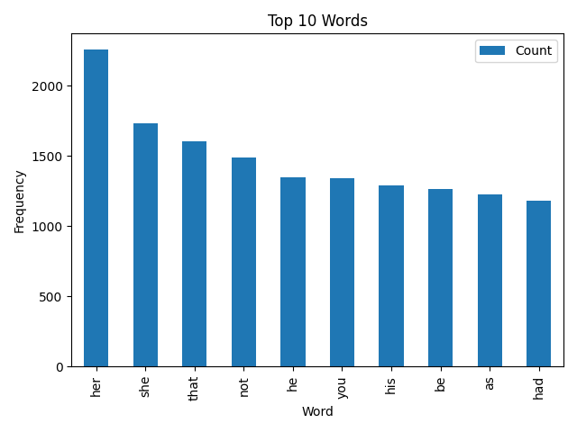

# 🕵️ Web Scraper Project

[](https://www.python.org/)
[](LICENSE)
[](https://github.com/Soumyadeeps006/web-scraper-project/actions)
[](https://github.com/Soumyadeeps006/web-scraper-project)

A simple yet effective web scraping and data analysis project written in Python. Extracts structured data from the web, analyzes it, and generates insightful reports — all with clean, modular code and unit tests.

---

## 📦 Features

- **Modular Structure**: Separated concerns for scraping, parsing, and analyzing.
- **Data Analysis**: Analyzes text frequency and generates visualizations.
- **Logging**: Clear logging throughout the pipeline.
- **Unit Tests**: Full test coverage using Python's `unittest`.
- **Configurable**: Easily change URLs and headers via `config/settings.json`.
- **Requirements**: Cleanly managed dependencies in `requirements.txt`.

---

## 🛠️ Technologies Used

- Python 3.8+
- `requests`: For HTTP requests
- `BeautifulSoup`: For HTML parsing
- `pandas`, `matplotlib`: For data analysis and visualization
- `unittest`: For unit testing

---

## 🚀 Getting Started

### 1. Clone the repo

    ```bash
    git clone https://github.com/Soumyadeeps006/web-scraper-project.git 
    cd web-scraper-project
    ```

### 2. Set up virtual environment

    ```bash
    python -m venv venv
    source venv/bin/activate  # On Windows: venv\Scripts\activate
    ```

### 3. Install dependencies

    ```bash
    pip install -r requirements.txt
    ```

---

## ▶️ Run the Project

    ```bash
    python run.py
    ```

---

## 🖥️ Screenshot



---

## 📁 Folder Structure

    ```bash
    ├── src/            # Core logic
    ├── tests/          # Unit tests
    ├── config/         # Config files
    ├── data/           # Raw scraped data
    ├── results/        # Generated reports and figures
    ├── venv/           # Virtual environment
    ├── requirements.txt
    ├── README.md
    └── run.py
    ```

---

## 📄 License

MIT License – see [LICENSE](LICENSE)